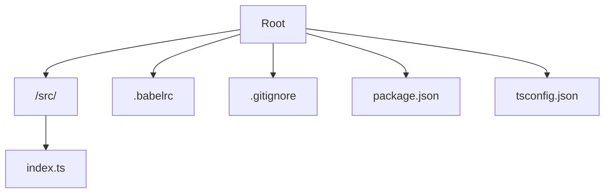

  

✨ Creating and executing a new Melon project

- Create and go to your project folder, you can use `mkdir` and `cd` or do it manually
- Use the command `npx melon new` and a default project will be created
- To execute, use the command `npm run go`

## 📌 What will happen?

A new set of pre-built files will be created in that folder, allowing you to develop
a new complete application from this base. For default, all Melon pre-built applications
are **TypeScript-based**.

